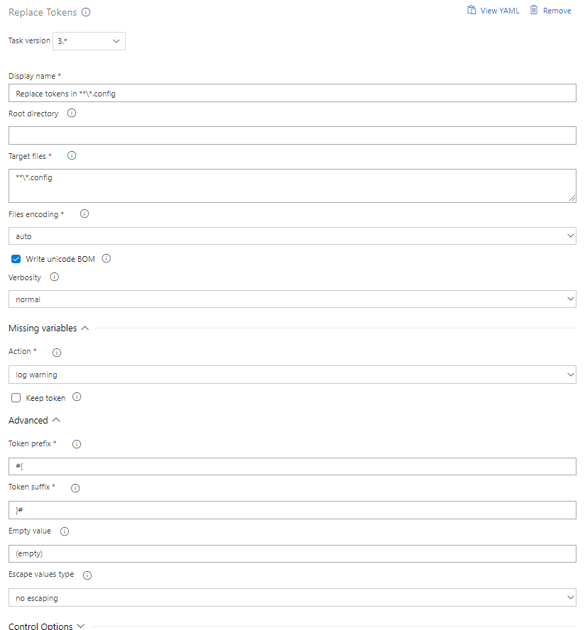

[](https://www.paypal.me/grouchon/5)

# Replace Tokens task
Visual Studio Team Services Build and Release extension that replace tokens in files with variable values.

## Usage
If you are using the UI, add a new task, select **Replace Tokens** from the **Utility** category and configure it as needed:



If your are using a YAML file, add a task with the following syntax:
```yaml
- task: qetza.replacetokens.replacetokens-task.replacetokens@3
  displayName: 'Replace tokens'
  inputs:
    targetFiles: |
      **/*.config
      **/*.json => outputs/*.json
```

Parameters include (in parenthesis the yaml name):
- **Root directory** (rootDirectory): the base directory for searching files. If not specified the default working directory will be used.
- **Target files** (targetFiles): the absolute or relative newline-separated paths to the files to replace tokens. Wildcards can be used (eg: `**\*.config` for all .config files in all sub folders).
> **Syntax**: {file path}[ => {output path}]  
>
> - `web.config` will replace tokens in _web.config_ and update the file.
> - `web.tokenized.config => web.config` will replace tokens in _web.tokenized.config_ and save the result in _web.config_.
> - `config\web.tokenized.config => c:\config\web.config` will replace tokens in _config\web.tokenized.config_ and save the result in _c:\\config\web.config_.
>
> **Wildcard support**
> - `*.tokenized.config => *.config` will replace tokens in all _{filename}.tokenized.config_ target files and save the result in _{filename}.config_.
> - `**\*.tokenized.config => c:\tmp\*.config` will replace tokens in all _{filename}.tokenized.config_ target files and save the result in _c:\tmp\\{filename}.config_.
>
> Only the wildcard _*_ in the target file name will be used for replacement in the output.\
> Relative paths in the output pattern are relative to the target file path.\
>
> **Negative pattern**\
> If you want to use negative pattern in target file, use a semi-colon `;` to separate the including pattern and the negative patterns. When using output syntax, only the wildcard in the first pattern will be used for generating the output path.
> - `**\*.tokenized.config;!**\dev\*.config => c:\tmp\*.config` will replace tokens in all _{filename}.tokenized.config_ target files except those under a _dev_ directory and save the result in _c:\tmp\\{filename}.config_.

- **Files encoding** (encoding): the files encoding used for reading and writing. The 'auto' value will determine the encoding based on the Byte Order Mark (BOM) if present; otherwise it will use ascii.
- **Write unicode BOM** (writeBOM): if checked writes an unicode Byte Order Mark (BOM).
- **Escape type** (escapeType): specify how to escape variable values. Value `auto` uses the file extension (`.json` and `.xml`) to determine the escaping and `none` as fallback.
- **Escape character** (escapeChar): when using `custom` escape type, the escape character to use when escaping characters in the variable values.
- **Characters to escape** (charsToEscape): when using `custom` escape type, characters in variable values to escape before replacing tokens.
- **Verbosity** (verbosity): specify the level of log verbosity. (note: error and system debug are always on)
- **Action** (actionOnMissing): specify the action to take on a missing variable.
  - _silently continue_: the task will continue without displaying any message.
  - _log warning_: the task will continue but log a warning with the missing variable name.
  - _fail_: the task will fail and log the missing variable name.
- **Keep token** (keepToken): if checked tokens with missing variables will not be replaced by empty string.
- **Token prefix** (tokenPrefix): the prefix of the tokens to search in the target files.
- **Token suffix** (tokenSuffix): the suffix of the tokens to search in the target files.
- **Empty value** (emptyValue): the variable value that will be replaced with an empty string.

## Tips
If you want to use tokens in XML based configuration files to be replaced during deployment and also have those files usable for local development you can combine the [Replace Tokens task](https://marketplace.visualstudio.com/items?itemName=qetza.replacetokens) with the [XDT tranform task](https://marketplace.visualstudio.com/items?itemName=qetza.xdttransform):
- create an XDT transformation file containing your tokens
- setup your configuration file with local developement values
- at deployment time
  - inject your tokens in the configuration file by using your transformation file
  - replace tokens in your updated configuration file

## Release notes
**New in 3.4.0**
- Add summary in logs with number of tokens found and replaced ([#126](https://github.com/qetza/vsts-replacetokens-task/issues/126)).

**New in 3.3.1**
- **Breaking change**: If you were using negative pattern you need to use the semi colon `;` as a separator instead of new-line in _Target files_.
- Fix negative pattern support ([#127](https://github.com/qetza/vsts-replacetokens-task/issues/127)).

**New in 3.3.0**
- Add support for custom output file and wildcard support ([#114](https://github.com/qetza/vsts-replacetokens-task/issues/114)).

**New in 3.2.2**
- Fix matching issue with directory ([#122](https://github.com/qetza/vsts-replacetokens-task/issues/122)).

**New in 3.2.1**
- Fix log issue with escaped secret values.

**New in 3.2.0**
- Switch to [jschardet](https://github.com/aadsm/jschardet) for encoding detection when selecting `auto` in _File encoding_ ([#99](https://github.com/qetza/vsts-replacetokens-task/issues/99)).
- Switch to [azure-pipelines-task-lib](https://github.com/Microsoft/azure-pipelines-task-lib) v2.8.0.
- Add `auto` to _Escape type_ and set it as default value.
- Move _Escape type_, _Escape character_ and _Characters to escape_ to the main paramters section for easier discoverability.

**New in 3.1.0**
- Add _Verbosity_ parameter to allow detail logs without using `system.debug`.

**New in 3.0.0**
- **Breaking change**: If you were using the character escaping feature you need to select `custom` in _Escape values type_ parameter.
- Add support to escape JSON in variable values (contributed by Justin Gould)
- Add support to escape XML in variable values (contributed by Justin Gould)
- Add `Windows 1252` and `ISO 8859-1` encoding to _File encoding_ ([#67](https://github.com/qetza/vsts-replacetokens-task/issues/67))

**New in 2.3.0**
- Add support to escape characters in variable values ([#52](https://github.com/qetza/vsts-replacetokens-task/issues/52))

**New in 2.2.1**
- Fix issue with backslash in default target files value on mac ([#50](https://github.com/qetza/vsts-replacetokens-task/issues/50))

**New in 2.2.0**
- Fix issue on file not found when using network paths ([#40](https://github.com/qetza/vsts-replacetokens-task/issues/40), [#41](https://github.com/qetza/vsts-replacetokens-task/issues/41)).

**New in 2.1.0**
- Add support for comma-separator in _Target files_ ([#35](https://github.com/qetza/vsts-replacetokens-task/issues/35)).
- Add _Empty value_ parameter to allow token replacement with an empty string ([#32](https://github.com/qetza/vsts-replacetokens-task/issues/32)).

**New in 2.0.2**
- Fix invalid file permissions after saving files.

**New in 2.0.0**
- **Breaking change**: Migrated code to typescript to support cross-platform agent. This change requires the use of an agent at least in version 2.105.0 which is **not compatible with TFS 2015**. If you need to install the task on TFS 2015, download the vsix from the repository: [https://github.com/qetza/vsts-replacetokens-task/releases/download/v1.4.1/qetza.replacetokens-1.4.1.vsix](https://github.com/qetza/vsts-replacetokens-task/releases/download/v1.4.1/qetza.replacetokens-1.4.1.vsix)
- **Breaking change**: _File encoding_ parameter is now used when reading and writing files. Previously it was only used when writing.
- **Breaking change**: _File encoding_ doesn't support 'utf-32' and 'utf-32 (big endian)' anymore.
- **Breaking change**: _Target files_ parameter now only uses the new line as a separator for multi-values (previously it used new-line and semi-colon).
- Removed required _Root directory_, an empty value is equivalent to $(System.DefaultWorkingDirectory).

**New in 1.4.1**
- Fix missing method issue with new xplat agent (2.104.1)

**New in 1.4.0**
- Add variables expansion in variable values.
- Escape token prefix and suffix in regex pattern.

**New in 1.3.1**
- Fix wrong encoding constructors parameters.

**New in 1.3.0**
- Replaced parameter _Fail on missing_ with _Action_ in _Missing variables_ group.
- Add _Keep token_ parameter in 'Missing variables' group.
- Fix issue on empty file.

**New in 1.2.0**
- Add _Root directory_ task parameter to configure file search root directory (contributed by Jesse Houwing).
- Update _Target files_ task parameter to support newline-separator (contributed by Jesse Houwing).